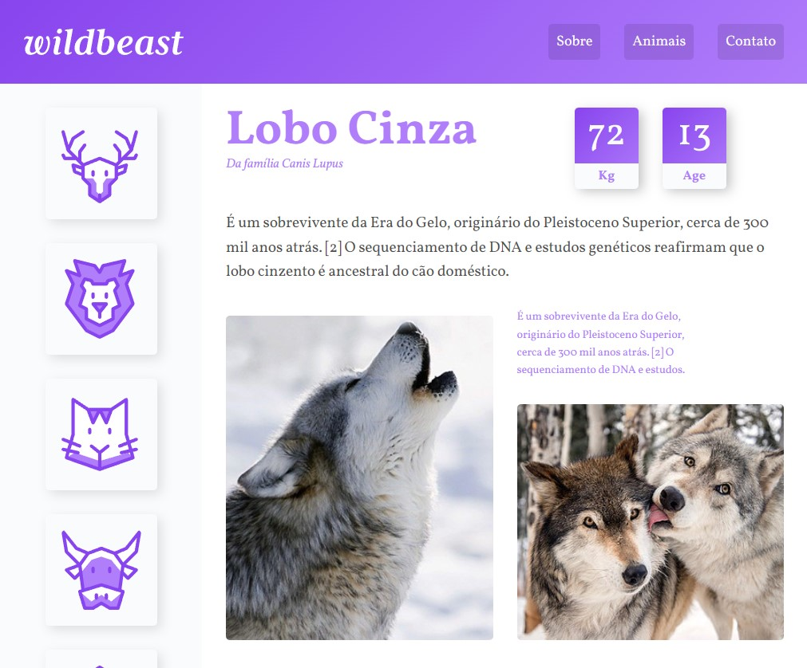

<h1 align="center">Landing Page com Grid Layout 🐺</h1>

<h2 align="center">Meu 7º projeto em Desenvolvimento Front-End ​​💻​​</h2> 

 

<h2 align="center">Sobre 📑</h2>

Protótipo de uma landing page completamente responsiva, utilizando exclusivamente a propriedade Grid Layout do CSS.
 

<h2 align="center">Tecnologias ​⌨️ ​</h2>

HTML e CSS
 

<h2 align="center">Para acessar ​🔗️</h2>

<a href="https://​nbra98.github.io/prototype-landing-page-grid-layout/" target="_blank">Clique aqui</a>
  

